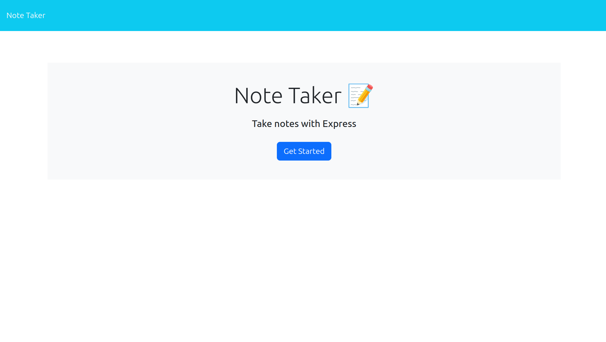
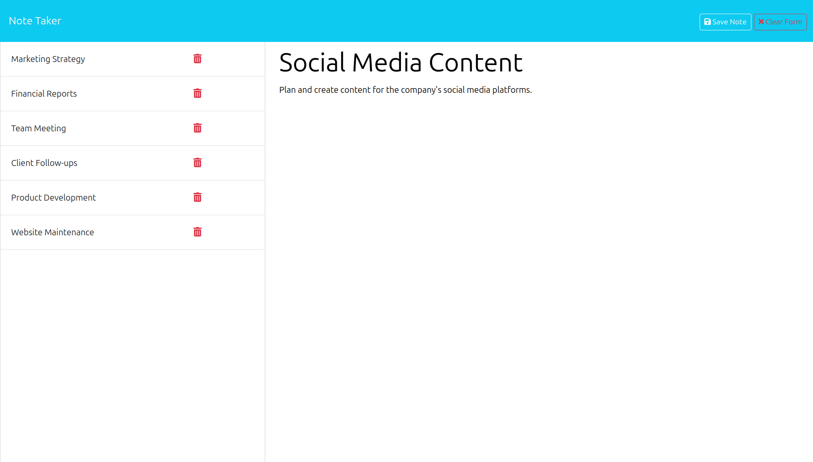
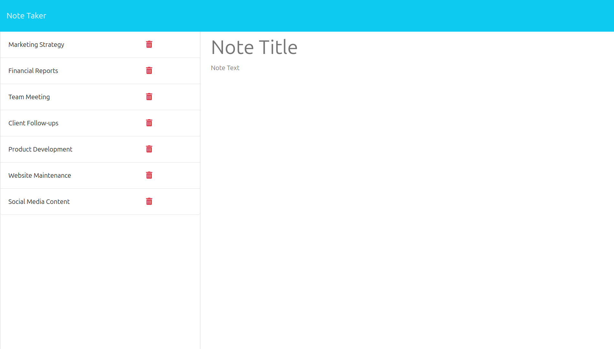
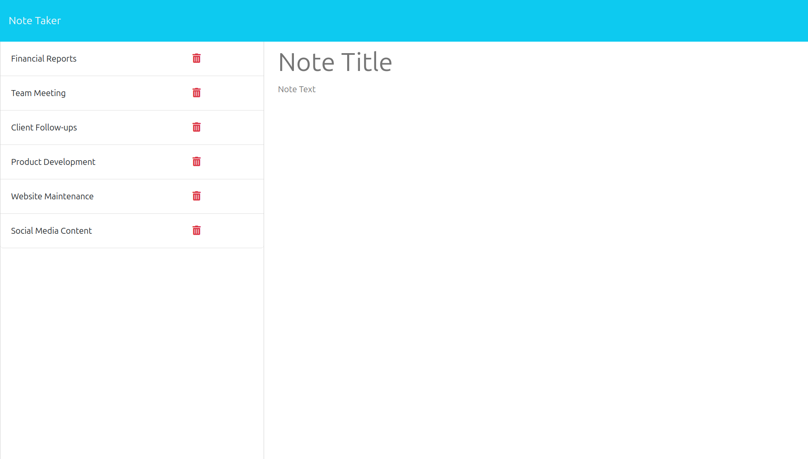

# Note-Taker-App


## Description

The Note Taker application is a user-friendly tool designed to help small business owners and individuals write, save, and organise notes. It features a landing page with a link to a dedicated notes page where users can view existing notes, enter new note titles and content, and save or clear notes. Saved notes are displayed in a list for easy access. Users can click on existing notes to view and edit them, or start a new note. The back end of the application, built with Express.js, handles note data storage and retrieval using a JSON file, ensuring that all notes are persistently saved. The application also supports deleting notes, providing a comprehensive note management solution.

## Live Demo

To access the live website, <a href="">click here</a>

## Table of Contents

- [Installation 🚀](#installation)
- [Usage 🏗️](#usage)
- [Key Features & Functionality ✨](#key-features--functionality)
- [Website Preview 🖼️](#website-preview)
- [Code Preview 💻](#code-preview)
- [Contributing 🤝](#contributing)
- [License 📄](#license)
- [Questions ❓](#questions)

## Installation 🚀

1. Clone the Repository:

```sh
git clone https://github.com/A-MOHAMED14/svg-logo-maker.git
```

2. Navigate to the Project Directory:

```sh
cd svg-logo-maker
```

3. Install dependencies:

```sh
npm install
```

## Usage 🏗️

1. Run the Application:

```sh
node server.js
```

## Key Features & Functionality ✨

- **Landing Page**: Upon loading, users are greeted with a welcoming landing page that includes a prominent link directing them to the notes page, where they can start managing their notes efficiently.

- **Notes Page**:

  - **Existing Notes**: Notes are conveniently displayed in the left-hand column, allowing users to quickly access and review their existing notes without any hassle.
  - **New Note Entry**: On the right-hand side, users are presented with empty fields where they can effortlessly input a new note title and its corresponding text to add to their collection of notes.
  - **Save and Clear**: The notes page features intuitive navigation with a "Save Note" button that enables users to securely store newly created notes. Additionally, a "Clear Form" button is available to reset the input fields, ensuring a seamless note-taking experience.

- **Note Management**:
  - **Save Notes**: Newly entered notes are promptly saved and seamlessly integrated into the list of existing notes, providing users with immediate access to their latest entries.
  - **View Notes**: Clicking on any existing note within the list allows users to view its content directly in the right-hand column, facilitating quick review and edits as needed.
  - **New Note**: Users can initiate a new note creation process at any time by clicking on the "New Note" button, which clears the current input fields and prepares the interface for a fresh note-taking session.
  - **Persistent Storage**: All notes are automatically stored and retrieved from a JSON file located on the application's back end. This ensures robust data persistence, allowing users to access their notes reliably across sessions.
  - **Delete Notes**: Functionality is provided to delete specific notes as needed. This action removes the selected note from the JSON file, effectively updating the list of notes displayed on the notes page to reflect the latest changes.

## Website Preview 🖼️









## Code Preview 💻


## Contributing 🤝

1. Fork the repository.
2. Create a New Branch:

```sh
git checkout -b feature/your-feature-name
```

3. Make your changes.

4. Commit Your Changes:

```sh
git commit -m "Descriptive message about your changes"
```

5. Push to the Branch:

```sh
git push origin feature/your-feature-name
```

6. Open a Pull Request.

## License 📄

This project is licensed under the MIT License. You are free to use, copy, modify, merge, publish, distribute, sublicense, and/or sell copies of the software, provided that the original copyright notice and permission notice are included in all copies or substantial portions of the software. For more details, see the MIT [LICENSE](https://opensource.org/licenses/MIT) file.

## Questions ❓

If you have any questions about the project, please feel free to contact me directly:

GitHub: <a href="https://github.com/A-MOHAMED14">A-MOHAMED14</a>

Email: <a href="mailto:amin800@hotmail.co.uk">amin800@hotmail.co.uk</a>
